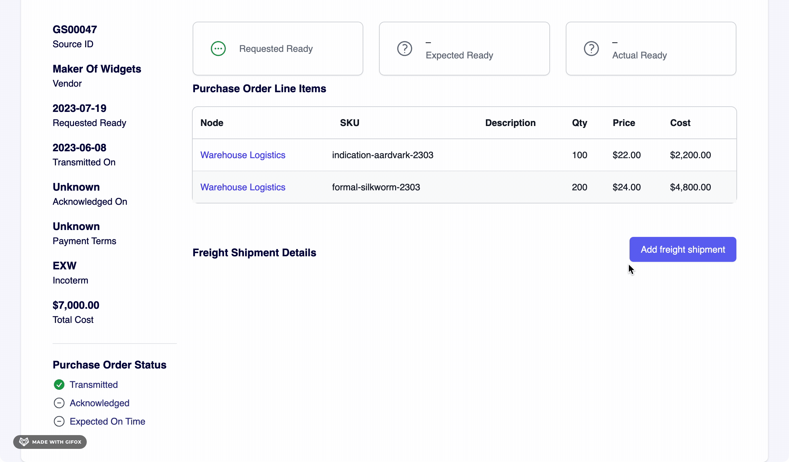

# Shipments
Shipments capture the movement of items between your vendors, and your nodes.

For inbound shipments, we link purchase orders with incoming deliveries. Sometimes POs get spread out over multiple shipments, or multiple POs are included in one shipment. This makes it difficult to determine when a purchase order has been fulfilled. With Turbine, you can keep track of what you have on hand and what's on the way. We also integrate with carriers such as UPS, C.H. Robinson, and others.

## Linking Shipments to Purchase Orders

Once tracking information is received from a carrier, you can link the shipment to a Purchase Order and calculate your landed costs.

1. Start by navigating to the Purchase Order you would like to add a shipment to. Click on the "Procure to Pay" tab in the navigation bar, then select "Purchase Orders," and choose the specific Purchase Order.

2. Scroll to the "Freight Shipment Details" section and click on the "Add Freight Shipment" button.

3. Enter the details of the shipment, including the carrier, tracking number, allocation method, and cost. Then, click "Save." The landed cost of each item will automatically populate.

Saved shipments will also appear on the Freight Shipments page. If it is a supported carrier, we will verify the entered information with the carrier's systems to ensure the price and tracking information is accurate. If so, information such as the shipped date and expected delivery date will be populated on the Freight Shipments page.
